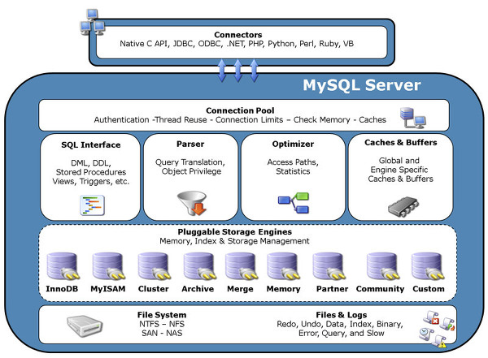
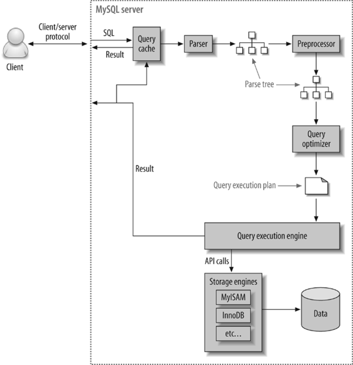
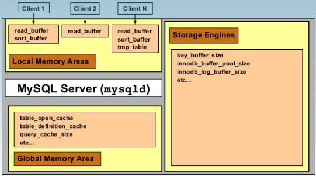
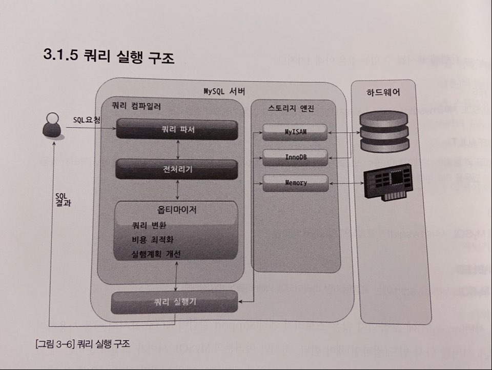
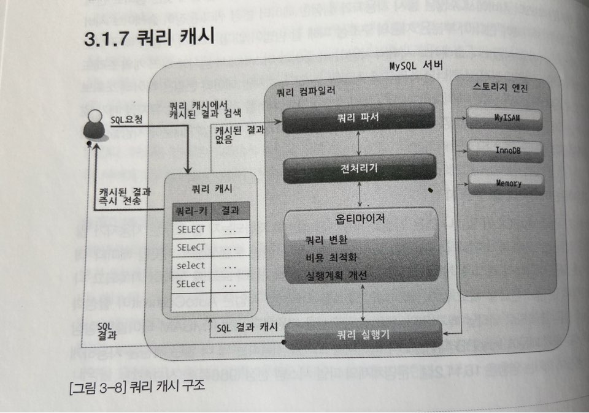

2020.11.01

 

## MySQL 아키텍처

 

</img>

MySQL은 C API, JDBC, ODBC, .NET 표준 드라이버 등을 제공 해주며, 여러 언어를 이용해 MySQL 서버에 쿼리를 보낼 수 있게 지원해준다. 

**응용 프로그램**

**MySQL 엔진**

**스토리지 엔진**

**OS, HW**

 

</img>

### **MySQL, 스토리지 엔진 실행 순서**

**SQL 파서 → SQL 옵티마이저 → SQL 실행기 → 데이터 읽기/쓰기 → 디스크 스토리지**

- **MySQL 엔진**
    - **Connection Handler : 클라이언트**의 **접속 및 처리 요청을 처리**한다.
    - **SQL Parser** : **사용자 요청** **쿼리 문장을 토큰 단위로 분리**하여 **트리 형태 구조로 생성**한다.
    - **Preprocessor** : **파서 트리를 기반**으로 **문장에 구조적인 문제점이 있는지 확인**한다.                         (**테이블, 컬럼 이름, 내장 함수와 같은 개체를 매핑**하여 **존재 여부와 접근 권한등을 확인**하는 과정이다.)
    - **Optimizer** : 사용자의 **요청으로 들어온 쿼리 문장**을 **저렴한 비용(자원)으로 빠르게 처리**할 지 **결정하는 역활**을 담당한다. **(더 나은 선택을 유도하는 과정 → MySQL 성능 최적화와 관계)**

- **스토리지 엔진**
    - 실제 **데이터를 스토리지에 저장하거나 읽어오는 부분을 담당하는 엔진**이다. **여러개의 엔진을 동시에 사용**할 수 있으며, **특정 테이블에 특정 엔진을 지정**하여 그것만 **사용할 수 있다.**

- **Handler API**
    - MySQL 엔진의 쿼리 실행기에서 스토리지 엔진에게 각 요청을 보내는데 이러한 요청을 **Handler 요청**이라고 하며 이때 사용하는 API를 **Handler API**라고 한다.

 

### MySQL 스레딩 구조

- **캐시 버퍼**
- **로그 버퍼**
- **포그라운드 스레드**

    최소한 접속된 클라이언트 수만큼 존재하며, 클라이언트에서 요청하는 쿼리 문장을 처리하는 것을 담당한다. 클라이언트가 커넥션을 종료하면, 담당하던 스레드는 캐시로 되돌아간다. 스레드 캐시에 일정 이상이 대기중이면, 스레드를 종료시켜서 갯수를 유지한다.

    프그라운드 스레드는 데이터를 데이터 버퍼나 캐시로부터 가져온다. 버퍼나 캐시에 없는 경우에는 디스크의 데이터나 인덱스 파일로부터 데이터를 읽어와서 작업을 처리한다.

- **백그라운드 스레드**

    InnoDB의 Insert Buffer 병합하는 스레드

    **로그를 디스크에 기록하는 스레드 (중요)**

    버퍼 풀의 데이터를 디스크에 기록하는 스레드

    **데이터를 디스크에 기록하는 스레드 (중요)**

    데이터를 버퍼로 읽어들이는 스레드

    기타 여러가지 잠금이나 데드락을 모니터링하는 스레드

    총괄적으로 관리하는 스레드

- **디스크 데이터 파일**
- **로그 파일**

</img>

### 메모리 할당 및 사용 구조

- **글로벌 메모리 영역 (서버가 시작되면서 운영체제로부터 할당되는 영역)**

    일반적으로 클라이언트 스레드의 수와 무관하게 하나의 메모리 공간만 할당된다. 필요에 따라    2개 이상의 메모리 공간을 할당받을 수 있으며, 모든 스레드에게 공유되는 영역이다.

    - 키 캐시
    - 버퍼 풀
    - 쿼리 캐시
    - 테이블 캐시
    - 로그 버퍼

- **로컬(세션) 메모리 영역 ()**

    MySQL 서버상에 존재하는 클라이언트 스레드가 쿼리를 처리하는 데 사용하는 메모리 영역이다.

    - **커넥션 버퍼**
    - Read 버퍼
    - 랜덤 Read 버퍼
    - 바이너리 로그 버퍼
    - Result 버퍼
    - **조인 버퍼**
    - **정렬 (Sort) 버퍼**

 

### 쿼리 실행 구조

</img>

 

**쿼리 캐시**

</img>

- 쿼리 캐시는 MySQL의 고유한 기능으로 복잡한 쿼리의 결과를 메모리에 캐시해두는 기능이다.
- 쿼리 문장이 캐시에 존재하는지, 권한이 있는지, 동일한 결과가 보장되는 것인지 등의 확인 작업을 통하여 만족할 경우 캐시된 결과를 제공한다.
- 쿼리 캐시 메모리도 한정되어 있기 때문에 일정 크기 이하의 쿼리만 캐시하게끔 설정할 수 있다.