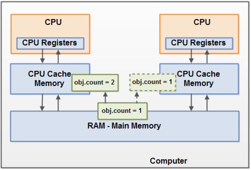

2020.11.04

### Atomic Variable 이란?

원자성을 보장하는 변수이다.


**Compared and Swap Algorithm**를 기반으로 동작한다.

</img>

멀티쓰레드환경, 멀티코어 환경에서 각 CPU는 메인 메모리에서 변수값을 참조하는게 아닌, 각 CPU의 캐시 영역에서 메모리를 참조하게 됩니다. 

이떄, 메인메모리에 저장된 값과 CPU캐시에 저장된 값이 다른 경우가 있는데 

이것을 가시성 문제라고 합니다.

가시성 문제를 해결하기 위해 사용되는 것이 바로 CAS 알고리즘입니다. 현재 쓰레드에 저장된 값과 메인메모리에 저장된 값을 비교하여 일치하는 경우 새로운 값으로 교체하고, 일치하지 않는다면 실패하고 재시도를 합니다.

이를 통해 CPU캐시에 잘못된 값을 참조하는 가시성문제를 해결할 수 있습니다.

```java
public class AtomicInteger extends Number implements java.io.Serializable {

  // 
	private volatile int value; 
        
        public final int incrementAndGet() { 
	    int current; 
            int next;
            do {

	              current = get(); 
                next = current + 1; 

            } while (!compareAndSet(current, next));

            return next; 
        } 
        
        public final boolean compareAndSet(int expect, int update) {
        	return unsafe.compareAndSwapInt(this, valueOffset, expect, update); 
        }	         
}
```
incrementAndGet()메소드 내부에서 CAS 알고리즘 로직을 구현하고 있습니다.

volatile 변수는 가시성 문제를 해결하기 위하여 사용됩니다 .

volatile 가 붙어있는 객체는 CPU캐시가 아닌 메모리에서 값을 참조합니다.

하지만 여러 쓰레드가 접근하였을 경우 안전하지 않기 때문에, CAS 를 같이 사용하여 병렬 쓰레드 환경에 대비합니다.