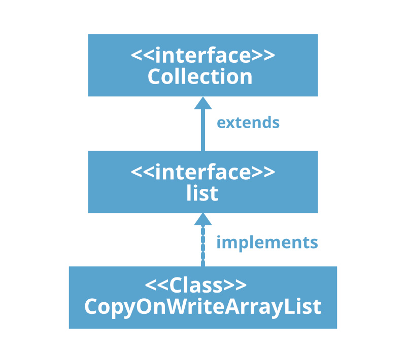

2020.10.14

<br/>

</img>

CopyOnWriteArrayList 

+ Set이나 Add 등의 조작 메서드 내부적으로 Synchronized Statement 를 사용하여 접근하는 쓰레드들을 동기화 해준다. 
+ 외부로 데이터를 전달할 때 내부 배열을 조작할 때마다 Snapshot 작업을 한 객체를 넘기기 때문에 여러 쓰레드가 동시에 접근하더라도 일관성 있는 정보를 전달할 수 있다. 
+ ( 객체의 복사는 요소를 조작할 때 이루어지고 해당 정보를 캐시하여 전달한다. ) 
+ 주로 소수의 쓰레드, 정보를 가지고 읽기(조회)를 사용하는 영역에서 쓰는 것이 좋다.

```java
// 내부 배열
private transient volatile Object[] array; 

final Object[] getArray() {
        return array;
}

final void setArray(Object[] a) {
        array = a;
}

public boolean add(E e) {
        synchronized (lock) { // Synchronized Statement
            // 내부 배열 값 전달
            Object[] es = getArray(); 

            int len = es.length;

            // 내부 Capacity 를 +1 추가
            es = Arrays.copyOf(es, len + 1); 

            // len 위치에 요소 추가.
            es[len] = e;

            // 내부 배열에 적용.
            setArray(es);

            return true;
        }
    }

public void add(int index, E element) {
       synchronized (lock) {
            Object[] es = getArray();
            int len = es.length;

            // Index 검증
            if (index > len || index < 0)
                throw new IndexOutOfBoundsException(outOfBounds(index, len));
            

            Object[] newElements;

            // 내부 배열 총 길이 - 저장 위치 = numMoved
            int numMoved = len - index;

            // 배열의 끝이면,
            if (numMoved == 0)
                newElements = Arrays.copyOf(es, len + 1);

            // 그렇지 않다면
            else {

//arraycopy(@NotNull Object src, int srcPos, @NotNull Object dest,
//                                            int destPos, int length)

// src − This is the source array.
// srcPos − This is the starting position in the source array.
// dest − This is the destination array.
// destPos − This is the starting position in the destination data.
// length − This is the number of array elements to be copied.

                newElements = new Object[len + 1];

                // es 배열을 newElements 에 전체 복사.
                System.arraycopy(es, 0, newElements, 0, index);

                // es 배열 index 부터 복사 배열의 index + 1 이후에 
                // 값을 복사. (빈 공간 생성.)
                System.arraycopy(es, index, newElements, index + 1,
                                 numMoved);
            }

            // 복사 배열 마지막 공간에 넘겨받은 값 저장.
            newElements[index] = element;

            // 내부 배열에 적용.
            setArray(newElements);
        }
    }


    public boolean remove(Object o) {

        // 내부 배열을 복사한 snapshot 배열 생성
        Object[] snapshot = getArray();

        // 복사 배열에서 값 조회
        int index = indexOfRange(o, snapshot, 0, snapshot.length);

        // True, False 여부 반환.
        return index >= 0 && remove(o, snapshot, index);
      }

        private static int indexOfRange(Object o, Object[] es, int from, int to) {
        if (o == null) {
            for (int i = from; i < to; i++)
                if (es[i] == null)
                    return i;
        } else {
            for (int i = from; i < to; i++)
                if (o.equals(es[i]))
                    return i;
        }
        return -1;
    }

    public E remove(int index) {

        synchronized (lock) {

            Object[] es = getArray();
            int len = es.length;

            // 복사 배열 내부에서 해당 Index 값을 반환
            E oldValue = elementAt(es, index);

            // 복사 배열 길이 - 넘긴 인덱스의 - 1 값
            int numMoved = len - index - 1;

            Object[] newElements;

            if (numMoved == 0)
                newElements = Arrays.copyOf(es, len - 1);
            else {
                newElements = new Object[len - 1];
                System.arraycopy(es, 0, newElements, 0, index);
                System.arraycopy(es, index + 1, newElements, index,
                                 numMoved);
            }
            setArray(newElements);
            return oldValue;
        }

    static <E> E elementAt(Object[] a, int index) {
        return (E) a[index];
    }
    }


```