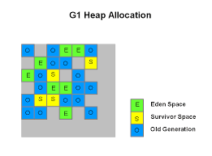

2020.10.20

**( Hotspot JVM )**

JVM 은 기본적으로 **Generational Collection 방식**을 사용한다. 

Heap 영역을 객체의 Generation 별로 **Young (Eden) / Survivor / Old Area 로 구별**한다.

**GC의 기본 매커니즘은 경험적 지식 (Weak Generational Hypothesis) 를 기반으로 한다.** 

- Object는 생성된 후 금방 Garbage Object 가 된다.
- Old Object는 Young Object를 참조할 일이 드물다.

첫번째의 경우 **메모리 할당은 빈 영역에 순서대로 할당**되기 때문에 **Garbage가 되어 제거될 경우 메모리의 단편화가 발생**할 수 있다.

이를 해결하기 위해선 **Compaction 같은 행위를 진행**하여야 하는데 그것을 회피하기 위하여 따로 **전용 공간인 Young 영역을 생성하고 Young 영역이 가득차 GC가 되는 경우** 살아있는  객체를 **피신시키는 공간인 Survivor 영역을 만든 것**이다.

 

**Young 영역의 GC ( Minor GC )**

- **Young 메모리 영역이 가득찰 경우 발생한다.**
- **Trancing** 알고리즘을 통해 Root Set 부터 참조 값을 추적하여 살아있는 **Reachable  Object** 를 **Marking** 한다.
- **Marking** **Object** 들을 **Survivor 영역으로 이동**시킨다. (**Survivor** 영역은 **꼭 하나만** 사용)
    - 만약 **Survivor 0**에 넣어놓고 작업을 했다면 해당 영역에서도 참조 값을 추적하여     확인한 뒤 Young 영역의 **Marking Object와 같이 Survivor 1으로 이동**시킨다. (반복)
- 만약의 Heap 존재하는 객체 중 Survivor 영역으로 넘어가지 못하는 객체는 **바로 Old     영역으로 이동**시킨다.
- 해당 영역 내에서 **Garbage Object를 제거**한다.

위의 행위가 반복되다가 객체의 수명 (Age Threshold) 이 임계점에 도달하면 Old 영역으로 이동된다.

 

**Reachable Object 가 영역을 이동하게 되는 조건**

- Eden 영역의 **메모리 공간이 가득**차게 된다면 **Survivor 영역**으로 이동시킵니다. (Minor GC)
- **Reachable Object**의 **수명이 일정 수치**를 **만족**하면 **Old 영역**으로 이동시킵니다.
- **Eden 영역의 객체**가 **Survivor 영역**으로 **이동**할 때 **들어가지 못하는 객체는 Old 영역**으로      이동됩니다.
- **Survivor 영역이 가득 찰 경우 , Eden과 Survivor의 인스턴스들은 Old 영역으로 이동합니다.**

 

Young 영역에서 **Trancing - mark** 작업을 진행할 때 **Old 영역의 객체도 참조하고 있는 경우 Old 영역까지 **탐색하는 것을 방지**하기 위해 **Card Table 이란 걸 사용**합니다. 

Old 영역의 일부는 Card Table 로 이루어져 있으며, Young 영역의 **객체를 참조하는 Old 객체**가 있다면 **해당 객체의 시작주소에 (일종의 Flag 값) Dirty로 표시**하고 해당 내용을 Card Table 에 **기록합니다.** 

이 기록된 값을 통해 **참조 중인 Young 객체가 UnReachable 되어 GC 된다면 같이** **GC** 합니다.

**Card Table은 Old Memory인 512 byte 당 1 byte의 공간을 차지합니다.**

 

GC 알고리즘과 모듈들

**Copy & Scavenge Algorithm - Minor GC**

**Eden, Survivor 영역**에 **Reachable Object 를 비어있는 Survivor 영역으로 복사**하고 (**Copy**) **UnReachable Object 를 해제**합니다. (**Scavenge**)

 

**Mark & Sweep & Compact Algorithm - Old GC, Full GC**

**Reachable Object** 를 식별하고(Mark), 영역을 훑어 **UnReachable Object**를 식별한 다음(Sweep)  **해당 Object 들을** 제거하고 **Reachable Object** 를 공간 한쪽으로 모읍니다. (**Compact**)

**Compaction 을 하는 이유**는 **메모리의 단편화**를 해결하기 위함입니다.

Old GC가 진행될 때 Application 수행이 정지되는데 이것을 **Stop-the-world** 라고 표현합니다. 이것은 GC를 수행하는 쓰레드를 제외하고 모든 쓰레드가 정지함을 뜻합니다.

 

</img>

### Serial GC

하나의 쓰레드만을 이용하여 GC를 수행하는 모듈이다. 속도가 느리기에 주로 실시간 응답이 필요치 않는 시스템에서 사용하는 편이다.

- 싱글 쓰레드, 적은 Heap 메모리 공간
- GC 모듈 중에서는 성능이 제일 낮음
- 실시간 요청이 많은 **WAS나 시스템에선 사용하지 않는 것이 좋다.**

 

### Parallel GC (JDK 8 - Default GC)

Eden 영역에선 병렬 쓰레드를 이용하여 GC를 수행하고, Old에선 하나의 쓰레드로 동작하는 GC 모듈이다.

- **Young 영역에서의 병렬 쓰레딩, 충분한 Heap 메모리 공간**
- 순간적으로 몰리는 트래픽도 Serial 에 비해서 상대적으로 많이 버틸 수 있다.

 

### Parallel Compacting GC (: Parallel Old GC )

**Parallel GC 를 개선한 모듈**로 Old 영역에서도 병렬 쓰레드로 동작하며, 그에 따라서 알고리즘 방식에 차이가 있다

- **Heap 영역 전체에서의 병렬 쓰레딩**, 충분한 Heap 메모리 공간
- Sweep에서 Summary로의 전환. (: **Old 영역을 다수의 쓰레드를 이용해 분할하여 훑는다** )
- **Compacting 하여 모인 객체**들은 따로 **별도의 쓰레드를 이용하여 탐색**한다                       (**한번의 GC 수행 후**)
- Full GC를 통한 Stop The World 도 **Serial, Parallel** 보다 **빠르게 수행**된다.

 

</img>

### CMS GC (Concurrent Mark Sweep GC)

Stop The World 시간을 줄이기 위해 고안된 모듈이며,  Old 영역에서 다른 알고리즘 방식을 사용한다

- **Compacting 과정이 존재하지 않는다. ( 메모리 단편화 문제가 발생할 수 밖에 없다. )**
- **시스템 자원을 많이 소모하며, 단편화 된 메모리가 많으면 오히려 시간이 더 걸릴 수 있다.**
- **Reachable Object 를 순차적으로 탐색한다.**
- **Mark - Concurrent Mark - Remark - Concurrent Sweep**

    클래스 로더에서 가까운 Reachable Object 를 찾고 (Initial Mark) 

    앞선 단계의 Object의 참조를 이용해 다른 모든 Object 를 식별한 다음 (Concurrent Mark) 

    앞선 단계에서 식별된 객체의 참조나 생성된 객체가 있는지 확인하고 (Re Mark)     

    UnReachable Object를 제거한다. (Concurrent Sweep)

 

</img>

### G1 GC (JDK 9+ - Default GC) - **처리량과 지연 시간의 균형**

CMS 의 메모리 단편화 문제를 해결하기 위해 고안된 모듈이다.

하나의 영역이 Eden, Survivor, Old영역의 역할을 동적으로 바꿔가며 GC가 일어난다.

- 기존 GC들은 2~3개의 영역만 분할하였지만 G1은 2000개 이상의 Region로 분할하여 사용한다.
- G1은 Heap 공간을 여러 Region으로 나누고 포인터를 이용하여 영역을 이동하며, Heap 영역 전체를 탐색하지 않고, Region 이라는 단위를 탐색한다.
- G1은 마킹 단계를 동시에 수행하기에 Application이 중지되지 않고도 Reachable Object를 식별할 수 있다.