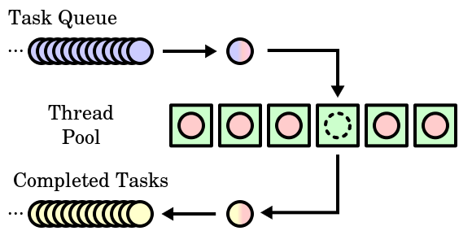

2020.10.30

 

Java Concurrent, Executors, Fork&Join

 

**Concurrent SW?** 

동시에 여러 작업을 할 수 있는 소프트웨어를 말한다.

 

**Java 가 지원하는 Concurrent?**

- **멀티프로세싱 (ProcessBuilder)**
- **멀티쓰레드 (Thread, Runnable)**

**Java 지원 Package**

- **util.concurrent : Asynchronous Tesk 실행, Thread Life Cycle 관리 등**
- **util.concurrent.atomic : 데이터 정합성을 지키는 원자적 변수 선언 기능 패키지**
    - **공유되는 변수의 값에 대해 멀티 쓰레딩할 때 데이터의 정합성을 위해 사용하는 Syschronized, volatile 키워드를 회피하는 기능의 모음. (성능 최적화를 위한.)**
- **util.concurrent.locks : 객체에 대한 잠금, 대기 기능을 제공하는 패키지**

 

**Executors**

- **High-Level Concurrency Programming**
    - 쓰레드를 만들고 관리하는 작업을 Application Logic 에서 분리
    - 해당 기능을 Excutors 에게 위임한다.

**Executors 가 하는 일**

- 쓰레드 풀 관리
- 쓰레드 생명 주기 관리
- 작업 처리 및 실행 : 쓰레드로 실행할 작업에 관련한 기능을 API로 제공

</img>

 

**Task Submitter - Executor**

- **스레드를 생성하고 재활용하며, 직렬적 혹은 병렬적으로 실행시킬 수 있다.**
- **executorService.submit(Runnable) - (Task Submitter)**
    - **(Runnable Task, delay, NANOSECONDS = TimeUnit.NANO_SCALE)**
        - Java Concurrent API는 Nano Sec 단위로 측정할 수 있다.

 </img>

 

**Task Queue - Blocking Queue**

- 대기중인 실행할 작업들 → Thread Pool의 상황에 따라 위임된다.
- 선입선출 방식의 데이터 처리 흐름을 말한다.
- 해당 큐는 Concurrent 에서 제공하는 큐로 멀티 스레드 환경에서 안정적이다.

**Thread Pool**

- **newSingleThreadExecutor → SingleThread 기반**
- **newFixedThreadPool(Thread Count) → Count 만큼의 Thread 생성**
- **newCachedThreadPool → Multi Thread 를 사용하고, 가능한 한 재사용하는 기능**

**주요 인터페이스**

- **Executors: execute**
- **ExecutorService (Executors 의 상속을 받은 Interface)**
    - callable 실행
    - Executor 종료
    - 병렬적인 Callable 실행 등의 기능을 제공
- **ScheaduledExecutorService (ExecutorService, ThreadPoolExecutor 상속받은 Interface)**
    - 특정 시간 이후, 주기적으로 작업이 실행 가능하다.
        - **schedule (Runnable tesk , delay , timeUnit. nanoSec, SECONDS)**
        - **scheduleAtFixedRate (Runnable tesk , initialdelay 기본 지연시간 , period = 주기 ,  timeUnit.SECONDS(ENUM Value)**

</img>

- **Fork/Join Framework**
    - **ExecutorService → AbstractExecutorService 의 구현체**
    - Thread 와의 연관성 관리 기능과 하드웨어를 더 효율적으로 사용하게끔 해준다.
        - **Fork** : 다른 프로세스 혹은 쓰레드, **Task를 여러 개로 분할**하여 **새로 생성**하는 것.
        - **Join** : **Fork** 해서 실행한 프로세스 혹은 **쓰레드, Task의 결과를 취합**한다는 것.
    - **작업을 잘게 나눌 수 있을 때까지 split하고 다른 task를 나누어 병렬 처리한 후 합산.**

    - **ForkJoinPool**
        - 쓰레드 풀의 일종. Task를 관리하고 모니터링을 수행한다
        - 내부적으로 Work stealing Algorithm 알고리즘을 사용한다
        - 사용 가능한 CPU 개수를 기반으로 쓰레드를 정의하고 관리한다.

    - **ForkJoinTask**
        - RecursiveTask의 상위 Class.
        - ForkJoinPool 에서 실행 가능한 Task는 ForkJoinTask 상속받은 클래스이다.

    - **RecursiveTask (Future 를 구현한 추상 클래스)**
        - compute 메서드를 구현하고, 실제로 작동하며 결과가 Join 된다.

    - **RecursiveAction (Future 를 구현한 추상 클래스)**
        - RecursiveTask와 비슷하나 결과를 리턴하지 않는다. → Join 되지 않는다.

    **Runnable**

    - 다른 쓰레드에 의해 실행이 가능한 클래스를 위한 인터페이스.
    - 쓰레드 클래스가 다른 클래스를 확장할 필요가 있을 때 Runnable 을 구현한다.
    - **반환 값이 없다**

    **Process**

    - **실행 중인 프로그램**, 디스크로부터 메모리에 적재되어 CPU의 할당을 받을 수 있다.
    - **OS로부터 주소 공간, 파일, 메모리 등을 할당**받으며 이것들을 **프로세스라고 한다.**
        - **Process Control Block, PCB**
            - 프로세스에 대한 중요한 정보를 저장하고 있는 OS의 자료구조.
            - **PID, 상태, 카운터, 레지스터, 스케쥴링, 메모리, I/O, 어카운팅(시간) 정보**

      

   </img>

    **Thread**

    - **Runnable을 구현한 클래스이다.**
    - **1개의 프로세스에서 여러개의 쓰레드가 동작**한다. (**경량 프로세스라고도 불린다.)**
    - **프로그램을 실행시키고, 각각의 스택과 로직, 데이터, 메모리를 공유하며 작동한다.**

    **Thread 주요 메서드**

    - **start**
        - 쓰레드에게 실행 요청을 보낸다.
    - **stop**
        - 쓰레드를 강제로 종료시킨다.
        - 스레드가 사용중이던 자원들이 불안전한 상태로 남겨지게 되는 문제가 있으므로 Deprecated 되었다.
    - **join**
        - 수행중인 쓰레드가 종료될 때까지 대기.
    - **Sleep**
        - 현재 쓰레드 작업 멈추고 다른 쓰레드에게 기회를 준다. ( lock을 놓진 않음 → **DeadLock**? )
    - **Interupt**
        - 수행중인 쓰레드에게 중지 요청을 보낸다.
        - InterruptedException을 발생시킨다.
    - **Join**
        - 다른 쓰레드가 끝날 때 까지 기다린다.

    **Daemon Thread**

    - 마스터 쓰레드의 작업에 대한 보조적인 역활을 하는 쓰레드이다.
    - 마스터 쓰레드의 작업이 종료되면, 그에 따른 데몬 쓰레드도 종료된다.
    - **setDaemon 을 통해 쓰레드를 Daemon Thread로 변경할 수 있다.**