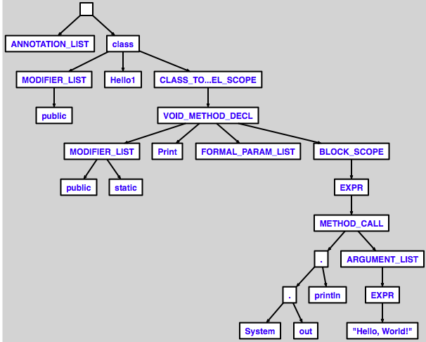

2020.11.03

 

Lombok 과 Annotation Processor

 

**Lombok 은 어떻게 동작할까?**

- 컴파일 시점에서 **Annotation Processor** 를 사용하여 코드의 **AST**를 조작하는 방식이다.
    - **AST? (: Abstract Syntax Tree )**
        - </img>

             

**Lombok 의 장점?**

- 기존에 **중복적으로 작성**하던 **Boilerplate Code**를 **Annotation으로 추가하게끔 지원한다.**
    - **getter, setter, equals & hashcode ... 등**

 

**Lombok 의 논란거리**

- API가 아닌 컴파일러 내부 클래스를 사용하여 기존 소스 코드를 조작한다.
    - 그로 인한 버전 호환성에 문제가 생길 수 있다. (컴파일러의 변경, 미지원 등)
    - 정상적인 방식의 기능 지원도 아니다. (일종의 해킹이다.)
        - 이클립스에서의 Lombok 은 Java Agent 를 이용하여 조작한다고 한다

 

- **Annotation Processor (JDK 5+ 내장)**?
  
    - 정의된 어노테이션의 소스코드를 분석하고 처리하기 위해 사용되는 처리기이다.
    - 컴파일 시점에서 어노테이션을 스캔하고 설정된 행위에 맞게 처리한다.
    - 컴파일 에러나 컴파일 경고를 만들어내거나, 소스코드(.java)와 바이트코드(.class)를 만들내기도 한다.
        - **이렇게 생성된 코드와 바이트코드를 실행 엔진에서 처리하는 것이다.**
    - **Annotation Processor는 rounds 라는 단위로 작업을 처리한다.**
        - **각 라운드마다** Processor 가 처리할 **애노테이션 가진 요소를 식별**하여 그에 따른 처리를 맡기게 되고 **해당 결과가 반영되거나 다음 round에 넘어갈 수 있다.**
        - **일종의 Chaining 처럼 처리하게 된다.**
        - **컴파일 동안 처리하고 기능을 제공하기에 런타임 비용이 필요하지 않다.**

 

- **AbstractProcessor 를 상속받아 구현할 수 있다.**
    - set<String> getSupportedAnnotationTypes
    - SourceVersion getSupportedSourceVersion
    - boolean process (annotations, roundEnv)

- **Filer**
    - 소스코드, Class code 및 리소스를 생성할 수 있는 Interface
    - Javapoel : 소스코드 생성 Util

- **그외**
    - @Override
    - AutoService
    - ...