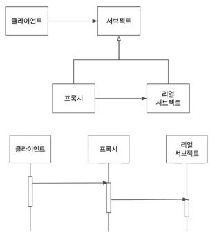
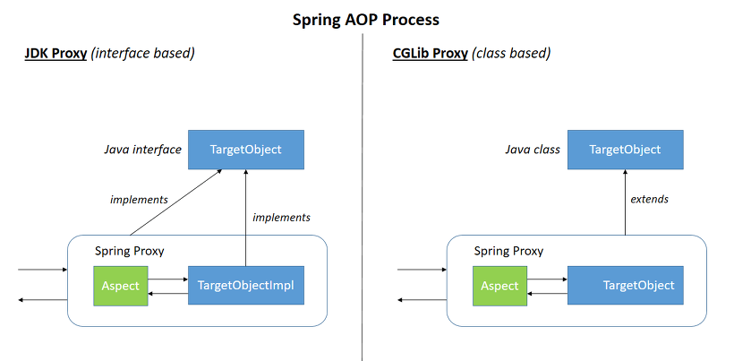

2020.10.27

<br/>

</img>

프록시와 서브젝트가 공유하는 인터페이스가 존재한다. (같은 타입이다.)

프록시는 리얼 서브젝트를 참조하고 있다.

**자신의 메서드 내부에서 참조하는 리얼 서브젝트의 메서드를 호출한다. (행위를 위임한다.)**

<br/>

클라이언트는 프록시를 통해 리얼 서브젝트 기능을 사용하기에 

- 접근 권한
- 부가기능
- 리턴 값 변경
- 로깅
- 트랜잭션 등

프록시 내부에서 호출하기 전에 이러한 기능을 추가 할 수 있다.

즉 리얼 서브젝트의 SRP를 해치지 않고 Proxy를 통해 책임을 추가할 수 있다.

<br/>

**Dynamic Proxy**

**런타임에 특정 인터페이스들을 구현하는 클래스나 인스턴스를 만드는 기술.**

- **Spring Data JPA**
- **Spring AOP (Method Invocation 을 사용하기에 메서드 래밸만 지원한다.)**
- **Mockito**
- **Hibernate - lazy initialzation**

<br/>

</img>

**JDK API Dynamic Proxy**

**제약**

- **Interface 기반의 Proxy** → 모든 Target Class는 Interface 를 **implement** 하고 있어야 한다.

**동작**

**Reflection API을 사용**해 **Target Class method를 invoke 하게 된다**.

**invoke?  클래스의 이름과 인자 값을 넘겨서 메서드를 실행시키는 함수.**

**JDK Dynamic Proxy 를 사용하는 라이브러리**

- Spring AOP **ProxyFactory** ( **JDK Dynamic Proxy 를 추상화하고 재정의한 Class**)
- Spring Data JPA **RepositoryFactorySupport** (BeanClassLoaderAware, BeanFactoryAware)

```java
// **RepositoryFactorySupport Create Proxy -> Bean 주입 -> 사용**
ProxyFactory result = new ProxyFactory();
result.setTarget(target);
result.setInterfaces(repositoryInterface, Repository.class, TransactionalProxy.class);

if....
```

<br/>

**CGLIB Dynamic Proxy (Spring, Hibernate - embed Library)**

**코드 생성 라이브러리(Code Generaor Library), 런타임에 동적으로 자바 클래스의 프록시를 생성해주는 기능을 제공한다.**

- 실제 바이트 코드를 조작하여 JDK Dynamic Proxy보다 상대적으로 빠르다.
- **CGLIB 프록시는 Interface 기반의 Proxy가 아니라 Target Class를 상속받아 생성한다.**
- **final이나 private 같이** **상속된 객체에** **Overriding 을 제공하는 않는다면 해당 행위에      대해서** **Aspect 를 적용할 수 없다.**

<br/>

**Spring 에서의 동작** 

**@Configuration 설정**의 경우 해당 설정 객체와 Bean을 CGLIB을 통해 지정한 객체를 상속받은 임의의 서브 클래스를 만들어서 그 클래스를 Bean으로 등록한다. (Singleton 보장)

**@Configuration 설정**이 붙지않은 Config 객체에 대해 내부 Bean 스캔시에는 CGLIB를 사용하지 않고 직접 해당 객체를 등록한다. → 2개 이상의 객체에 대한 의존관계 주입 시 싱글톤이 보장되지 않을 수 있다. 

```java
// handler? proxy 객체의 메서드를 호출할 때마다 해야할 일을 알려줌 
MethodInterceptor handler = new MethodInterceptor() {
	BookService bookService = new BookService();
	
	@Override
	public Object intercept(Obejct o, Method method, Obejct[] objects, 
																										MethodProxy methodProxy)    throws {
            // 리얼 서브젝트와 인자 값을 넘김.
			return method.invoke(bookService, args); 
	}
};

BookService bookService = (BookService) Enhancer.create(BookService.class, handler);
```