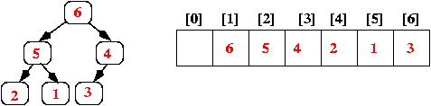

2020.11.02

 

### Priority Queue?

</img>

 

들어간 순서에 상관없이 일정 규칙에 따라 우선순위를 설정하여 해당 데이터를 먼저 데이터를 꺼내는 자료구조이다.

- Null 값이나 비교 불가능한 객체를 허용하지 않는다.
- 저장 공간으로 Object Type의 배열을 사용하며, 각 요소를 Heap이라는 자료구조 형태로 저장한다.
- **Java의 정렬 방식(낮은 값부터→) 혹은 Comparator 를 통해 정렬한다.**
- Thread-safe 한 큐 필요한 경우 **PriorityBlockingQueue** 를 사용한다.
    - 내부적으로 Lock Object와 Method Handler를 통해 변수를 관리한다.
    - 내부에 요소가 없을 경우 접근을 방지한다.