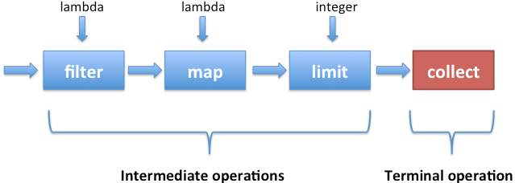

2020.10.29

### Stream API

Lambda expression 과 Method Reference 기능과 결합하여 어려운 데이터 작업을 쉽게 처리하기 위해서 추가된 API이다.

외부 코드를 이용하여 반복 작업을 처리하는 것이 아니라 내부에서 정의된 코드가 반복적으로 실행된다.

for 이나 iterator 객체를 생성하는 등에 반복적이고 예외가 일어날 수 있는 작업을 방지한다.

 

**Stream의 기본 Interface는 BaseStream 과 Generic Type 으로 추가적으로 정의되어 있다.**

- **<T, S extend BaseStream<T, S>>**
    - **T** : Stream에서 처리할 데이터의 타입을 의미한다.
    - **S** : BaseStream을 구현한 Stream 구현이며, 추가적으로 Stream 을 종료하기 위한 AutoCloseable Interface 를 구현해야 한다.
    - **대상 : onClose(), parallel, unordered...**

**그외 Stream Interface**

- **Primitive Type 처리에 특화된 Stream → BaseStream 상속 (상속 구조상 동일한 계층)**
    - **Double, Int, LongStream**
        - 기본형 데이터를 사용함으로써 박싱 / 언박싱 을 하지 않고, 객체 생성 등을 하지 않기에 더 빠른 성능을 보장한다.
        - sum, max, min 등의 결과 값에 대한 최종 연산을 제공한다.
        - boxed 라는 메서드를 제공한다 (Primitive → Wrapper Type)

 

</img>

**Stream의 개념**

- Pipeline , 데이터 소스는 터미널 오퍼레이션을 실행할 때만 처리한다.
    - **collect, reduce, forEach**
- Stream은 한번 사용하면 재사용할 수 없다. (컬렉션이 아니다.)
- 원본 객체를 조작하지 않는다.
- 각 메서드가 빌더 패턴과 같이 스트림 객체를 반환하고 메서드를 호출한다.
- 데이터가 흘러가는 순으로 가공 (중개 연산) 되는 것이다.

**스트림 소스 → 스트림의 생성 → 스트림의 중간 연산 → 최종 연산 → 반환 (소모)**

 

**Stream의 중간 연산**

주어진 데이터에 연산 작업을 수행하고 다른 스트림 객체를 리턴하는 메서드.

기본적으로 Lazy 하며, 쉽게 병렬 처리를 할 수 있다.

**대부분 Stateless 메서드이지만, Stateful 메서드도 존재 (distinct, sorted)**

- **map (Function a를 받아서 b로 반환) - 변경하기**
    - **mapToDuble ( ToDoubleFunction , a를 받아서 double 형 b를 반환)**
    - **mapToInt ( ToIntFunction ...)**
    - **mapToLong ( ToLongFunction )**
- **boxed - 변경하기 (primitive → wrapper)**
- **filter (predicate ) - 걸러내기**
- **skip - 제한하기**
- **limit - 제한하기**
- **sorted (Comparator)**
- **distinct**
- **generate - 생성하기**
- **iterate - 생성하기**

 

**Stream의 최종 연산**

스트림 데이터를 소모하고 종료시키는 메서드. 

스트림을 반환하는 것이 아니고 데이터를 반환한다.

- **collect**
    - (**Collectors.toList())**
    - (**Collectors.toMap())**
    - (**Collectors.toSet())**
- **count**
- **forEach**
- **toArray**
- **Stream**