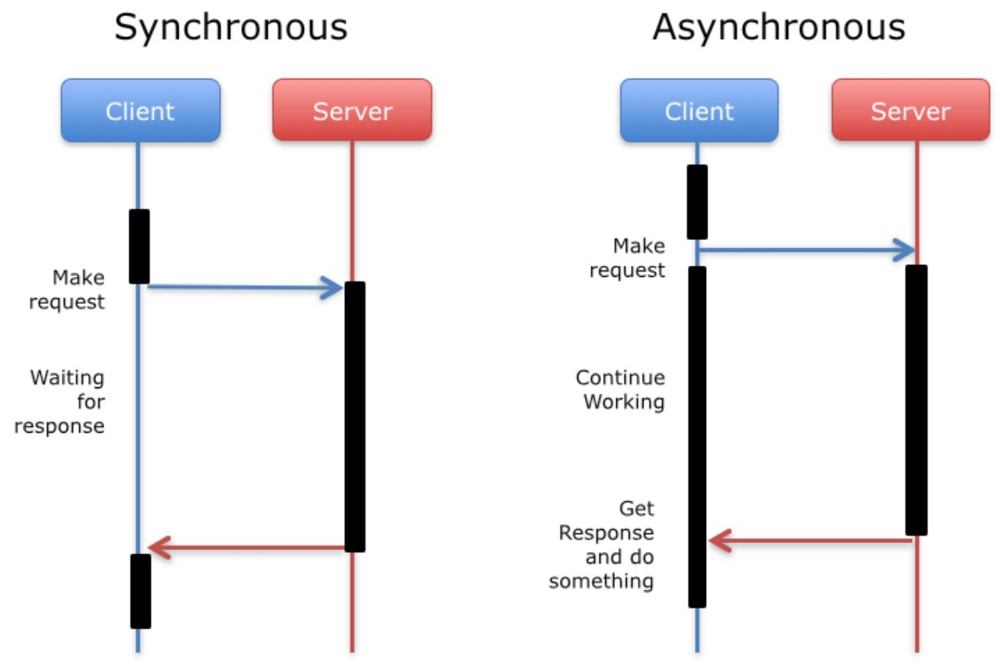

2020.10.30

</img>

Synchronous, Asynchronous 

**Synchronous - Blocking**

- **요청과 그 결과가 동시에 일어난다는 것**
- **하나의 메인 쓰레드가 직렬적으로 작업을 수행한다.**
- **반환되는 순서가 정해져 있다. (호출되는 순서로 반환이 될 수 밖에 없다.)**
- **메서드에게 제어권을 넘기고 프로그램이 정지한다. (File I/O, Network 등)**

**Asynchronous - Non-Blocking**

- **비동기는 동시에 일어나지 않는다는 것**
- **작업을 진행하던 중 File I/O등을 만나면 제어권을 넘겨 다른 작업을 수행할 수 있다.**
- 로직이 처리되는 대로 결과를 반환하기에 순서가 정해져있지 않다.
- **값이 반환되면 Handler를 통해 감지하고 다음 작업을 진행한다.**