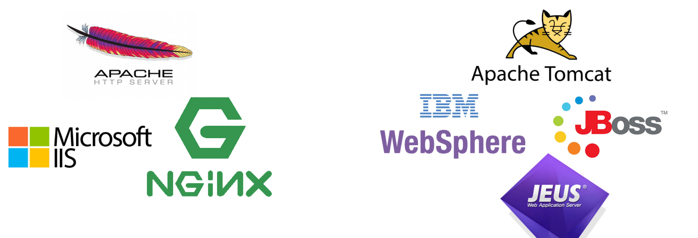

2020.10.15

 

</img>

Web Server : HTTP 요청을 통해 정적인 컨텐츠를 제공해주는 서버를 말한다.
+ image, html, css, javascript 파일과 같이 컴퓨터에 저장되어 정적 컨텐츠
+ 항상 동일한 페이지를 반환한다.

 

WAS? : Web Application Server (톰켓) : Web Server + Web container

웹 브라우저를 통해 이용할 수 있는 응용 소프트웨어

application과 서버 환경을 만들어서 동작되고,  비즈니스 로직이나 DB 조회 같은 동적인 컨텐츠를 요청에 맞게 제공한다.
Web Container 혹은 Servlet Container 라고도 불린다.

 

</img>

 

좋은 시스템 구조?

클라이언트 → Web Server → Web Container

 

위의 구조를 이용하여 기능을 분리하여서 서버의 부하를 방지할 수 있다.

정적 컨텐츠는 아파치 서버에서 제공. 동적 컨텐츠는 톰켓에서 제공

물리적인 분리를 통해 보안 강화를 제공할 수 있다.

다른 종류의 WAS를 이용하여 다른 언어로 Application을 제공할 수 있다.