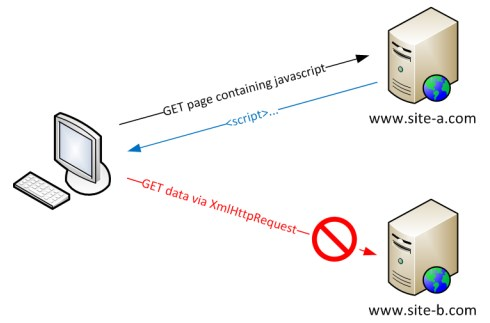

2020.10.27

### CORS (Cross-Origin Resource sharing)

 

**SOP ( Same-Origin Policy : 동일 출처 정책)**

</img>

어떠한 출처(Origin)에서 불러온 리소스가 다른 출처에서 가져온 리소스와 상호작용하는 것을 제한하는 보안 방식이다.

 

**동일한 출처 (Same Origin) 를 판단하는 요소는**

- URL Protocol
- Host
- Port

를 말한다.

 

**SOP로 인해서 AJAX 같은 기술을 사용할때 우회할 방법이 필요하게 되었다.**

(다른 도메인의 리소스를 받기 위하여서)

- JSONP
- Reverse Proxy
- Flash Socket

**하지만**

**발생되는 보안, 기타 문제에 의해 Cross Domain 이슈를 해결하기 위한 표준이 필요.**

 

</img>

**CORS 표준의 등장**

- 웹 브라우저가 외부 도메인 서버와 통신하기 위한 방식을 표준화한 스펙이다.
- 서버와 클라이언트가 **정해진 헤더를 통해서 요청, 응답에 대한 반응을 결정**한다.
- **WHATWG - Fetch Living Standard 사양 등**

 

**CORS 동작 조건**

- **클라이언트는 요청메시지 헤더에 Origin 에 자신의 오리진을 넣어준다.**
- 서버는 헤더에 **Access-Control-Allow-Origin** 에 **요청에 접근할 수 있는** Origin 을 담는다.
- **클라이언트의 Origin 이 이에 해당하지 않는다면 응답 메시지에 접근할 수 없다.**

 

**CORS 동작 방식**

- **간단한 요청 (Simple Requests)**
    - 기존 데이터에 **사이드 이펙트 (보안 이슈)**를 일으키지 않는 요청
    - **CORS의 Preflight Requests**을 발생시키지 않는 요청
    - **GET, HEAD, POST 중 한가지 방식을 사용한다.**
        - **Custom Header가 존재하지 않는다.**
        - **POST일 경우 Content-Type 이 urlencoded, multipart/form-data, text/plain 중 하나여야 한다.**

    **사이드 이펙트가 존재할 수 있는 요청의 경우 총 4번의 메시지가 오가게 된다.**

    - **Preflight request  →  response  →  original request  →  response**

- **사전 요청 (Preflight Requests)**
    - **OPTION 메소드를 이용하여 서버에서 지원하는 메소드를 확인하는 요청이다.         서버에서 해당 요청을 승인(approval) 할 경우에만 실제 요청을 보내도록 한다.**
    - **사이드 이펙트**를 불러일으킬 만한 **(보안이슈)** 요청에 대해서 브라우저가 **사전요청** 하도록 강제한다. **( 특정 MIME Type의 Post 등 )**
    - 클라이언트에게 **Credential (HTTP Authentication, Cookie 등)** 을 **요구**하기도 한다.

- **인증을 이용한 요청 (Credential Requests)**
    - XHR은 기본적으로 요청을 보낼 때 쿠키를 전송하지 않는다.
    - 요청에 쿠키를 포함하고 싶다면 XHR 의 withCredentials 값을 true로 설정한다.
    - 서버 측도 **Access-Control-Allow-Credentials 헤더를 true를 설정한다.**