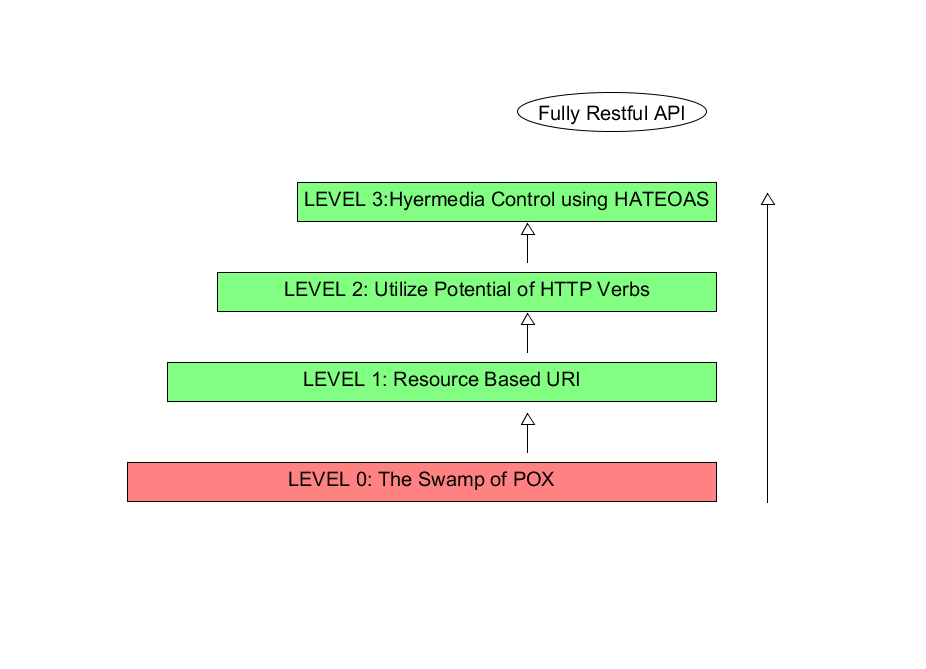

2020.10.28

 

**REST = REqresentational (표현), State (상태), Transfer (전달) : SW 아키텍쳐** 

**RESTful이란 REST란 아키텍쳐의 제약조건을 모두 만족하는 시스템을 말한다.**

**Resource : 모든 정보.**

**REqresentational : 리소스를 표현하는 구체적인 방법, JSON, XML, HTML..**

 

**REST 아키텍쳐의 구성, 제약 조건**

- **Client-Server Model**
- **Stateless [ 3 way Handshaking, 4 way Handshaking]**
    - Client와 Server의 통신에는 상태가 없어야하고 필요한 모든 정보를 담고 있어야한다.
- **Cache**
    - SELECT와 같은 조회성 트랜잭션을 캐싱하여 제공한다.
- **Uniform Interface**
    - **Identification of resources**
        - 자원은 유일하게 식별가능해야 한다.
        - 하나 이상의 유일한 URI로 식별이 되는가?
    - **mainipulation of resources throufg represenations**
        - HTTP Method로 CRUD라는 표현을 담아야 한다.
        - 안전한 오퍼레이션과 안전하지 않은 것에 대한 강한 분리를 제공해야 한다.
    - **self-descrive messages**
        - 메시지 스스로 자신에 대한 설명이 가능해야 한다. (서버가 바뀌더라도)
        - Header -> 미디어 타입을 정의하고 리소스를 전달할 때 content type을 사용한다.
        - 문서에 대한 링크를 Request 본문에 담기만 해도 만족할 수 있다.
    - **hypermidea as the engine of application state (HATEOAS)**
        - 하이퍼 링크를 통해서 application의 상태 변화가 가능해야 한다.
        - 데이터에 대해서, 안에서 링크를 제공해야 한다. (HAL)
        - 링크 정보를 동적으로 바꿀 수 있다. (prev, self, next..)
        - 요청 URI가 변경되어도 클라이언트 측에서 그에따른 코드 변경을 하지 않아도 된다.
- **Layered System**
    - 계층적으로 구성이 가능하여야 한다.
    - 클라이언트는 서버만 호출해야 한다.
- **Code-On-Demand (Optional)**
    - 서버가 네트워크를 통해 클라이언트에 프로그램을 전달하면 그 프로그램이 클라이언트에서 실행될 수 있어야한다. (Javascript.. )

 

</img>

**Richardson Maturity Model**

- **level 0 : The Swamp of POX**
    - HTTP에 RPC 를 기반으로한 원격 통신을 위한 터널링 메커니즘이다.
    - POX (Plain Old XML) 를 주고 받는 단순한 RPC 스타일 시스템
        - **RPC? (Remote Procedure Call)** : 원격 제어를 위한 코딩 없이 다른 주소 공간에서      함수나 프로시저를 실행할 수 있게 하는 프로세스 간의 통신 기술
- **level 1 : Resource**
    - 모든 요청을 단일 end point 가 아니라 자원에 따른 개별 리소스 point 로 통신한다.
- **level 2 : HTTP Verbs**
    - HTTP Method인 GET, PUT, DELETE를 사용한다.
- **level 3 : HATEOAS**
    - 클라이언트가 서버와 동적인 상호작용이 가능하다.
    - 서버로부터 어떠한 요청을 할 때, 요청에 필요한 URI를 응답에 포함시켜 반환한다.