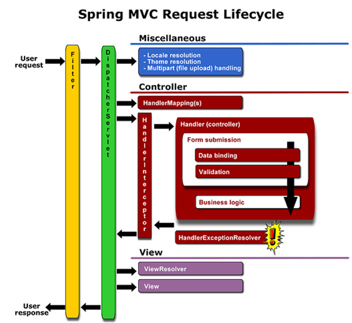

2020.10.23

</img>

**Filter (Servlet Container)**

- 클라이언트의 요청이 발생되면 DispatcherServlet 진입 전에 실행됩니다.
- 들어오는 요청과 응답을 걸러내어 정제하는 역할을 합니다. (인코딩, XSS 방어 등)

Filter의 실행 Method

- Init() : 필터 인스턴스 초기화에 사용됩니다.
- doFilter() : 전 / 후 처리에 사용됩니다.
- destroy() : 인스턴스 종료시에 사용됩니다.

 

**Interceptor (On Spring Application)**

- Filter가 실행된 뒤 DispatcherServlet에서 Controller 호출할 시점의 전, 후와 화면처리 후 수행됩니다. **(View Page 랜더링 후)**
- Spring context 영역 내부에서 Controller (Handler) 에 관한 요청 / 응답 처리를 합니다.
- IoC 컨테이너로 관리되는 모든 Bean에 대해서 접근 할 수 있습니다.
- (로그인 체크, 권한 체크, 프로그램 실행 시간 계산, 로그 확인 등)
  
 

Interceptor의 실행 Method

- preHandler() : 컨트롤러 메서드가 실행되기 전
- postHandler() : 컨트롤러 메서드의 실행 직후 (View 렌더링 전)
- afterCompletion() : View 가 렌더링 된 후
- Filter와 Interceptor는 Servlet 단위에서 실행되고, AOP는 프록시 패턴을 통해 실행됩니다.
  
 

**공통적으로 사용되는 부분**

- **인코딩 변환, 인증 (로그인 체크), 인가 (권한 체크), XSS(Cross site script) 방어에 사용**되고,    모든 페이지 내용에 **공통적으로** 작동하는 작업을 끼워넣는데에 많이 사용된다.

 

실행 순서는 Filter -> Interceptor -> Interceptor -> Filter 순으로 진행됩니다.

 

</img>

client까지 포함한다면

(client) MockHttpServletRequest (Post) -> doFilters -> DispatcherServlet -> preHandler -> controller -> postHandler -> DispatcherServlet -> viewresolver -> view -> afterCompletion() -> doFilters- (client) MockHttpServletResponse

순으로 진행됩니다.
