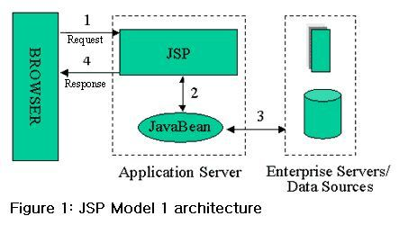
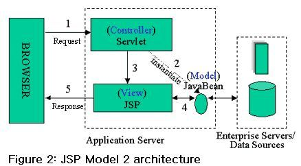

2020.10.27

 

**MVC 란 ?**

Model, View, Controller 의 줄임말로써 하나의 Application 구조를 요소별로 나눈 것이다.

- **Model**

    프로그램의 내부 상태, 데이터, **객체를 말한다.**

- **View**

    사용자의 인터페이스, 보여지는 화면, ( **Html, JSP, Thymeleaf, React... )**

- **Controller**

    요청에 따른 데이터 - 로직 간의 상호 작용, DispactherServlet, @Controller

 

**MVC Flow ?**

1. 사용자가 요청을 컨트롤러에게 보낸다.
2. 컨트롤러는 모델을 사용하고 모델은 비즈니스 로직을 수행한다.
3. 컨트롤러는 뷰를 선택한다.
4. 선택된 뷰는 컨트롤러에게 로직의 결과값을 받아 유저에게 화면을 구성하여 제공한다.

 

**MVC의 장점?**

- 각 컴포넌트의 코드 결합도를 낮출 수 있다.
- 관련있는 기능을 묶어서 모듈화하여 높은 응집도를 가진다.
- 코드의 재사용성을 높일 수 있다.
- 책임을 분리함으로써 코드의 유지보수가 쉽다.
- 구현자들 간의 커뮤니케이션 효율성을 올릴 수 있다.

 

**MVC의 단점?**

- 코드와 구조의 일관성 유지에 노력이 필요하다.
- 구현된 기능을 파악하기 위해 노력이 필요하다.
- 구조의 복잡함으로 인해 높은 학습 곡선이 필요하다.

 

</img>

**JSP (Java Server Page) 가 View와 Controller, Service 라는 책임을 동시에 지니고 있는 구조.**

**사실상 MVC 구조라고 말하기 어렵다.**

**요청 Flow**

1. JSP가 해당 요청을 받고
2. 비즈니스 로직을 처리하고, 
3. 데이터를 JavaBean (Model) 에게 요청하거나, JSP에서 쿼리를 수행하고
4. 해당 결과를 View 에 반영한다. (Flow Logic)

**특징?**

- View와 Logic이 섞여있다.

**장점?**

- 별다른 학습없이 빠른 개발이 가능하다.

**단점?**

- JSP는 데이터를 검색하고, 표시하고, 비즈니스 로직을 처리한다. - **관점 분리의 어려움**
- JSP는 여러 로직을 처리하기 때문에 거대하고 유지보수가 어렵다. - **복잡한 JSP**

 

</img>

**MVC1 에서 여러 책임이 혼재된 JSP의 복잡성을 해결하기 위해 도입되었다.**

**Servlet이 Controller 로써 View를 선택하며, JSP 에서 결과 값을 View로 전달하는 구조.**

- **MVC의 아키텍처를 따라간 구조.**

**요청 Flow**

1. Servlet이 요청을 받고 그에 맞는 JavaBean을 호출한다.
2. JavaBean이 그에 맞는 로직을 처리하고 데이터를 호출한다.
3. Servlet이 View를 선택한다.
4. View가 JavaBean에게 결과값을 요청한다.
5. 값을 반영한 화면을 제공한다.

**특징?**

- Controller, Service, View를 모듈화 하였다.

**장점?**

- MVC 1와 달리 일정 부분을 모듈화 함으로써 유지보수와 확장이 용이해졌다.

**단점?**

- 구조 설계를 위한 시간이 많이 소요되게 되어 개발 기간이 증가한다.