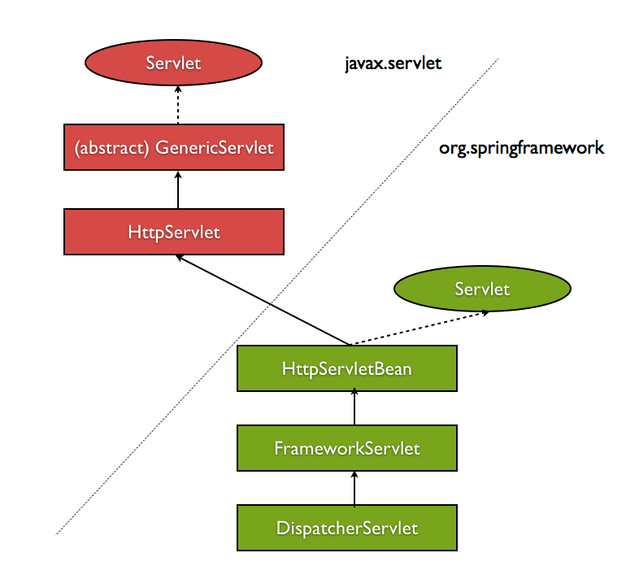
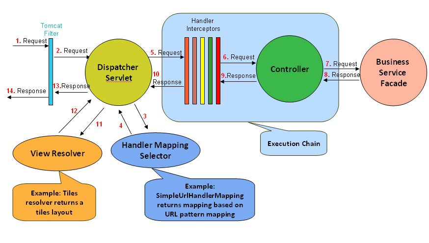
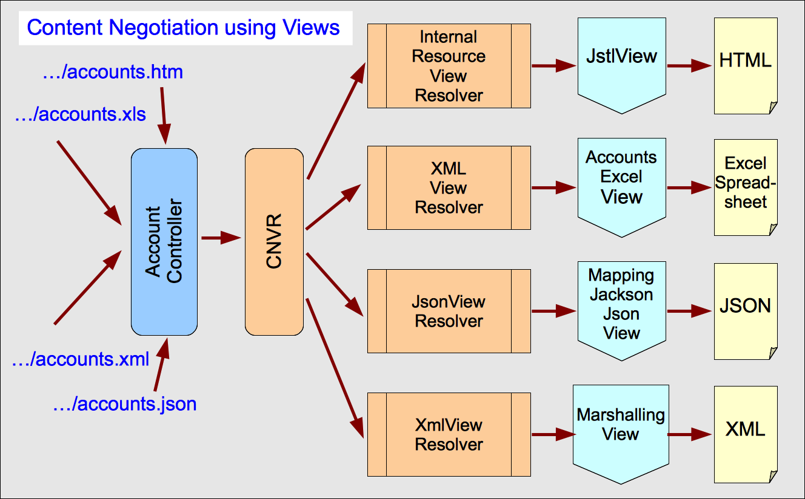

2020.10.23

 

</img>

**Servlet**

- 웹 서비스를 위한 Interface 뜻하기도 하고 해당 Interface의 구현체이기도 합니다.
- Servlet Container 를 통해 등록되고 Life Cycle 을 관리해줍니다.

 

**Servlet Container**

- Servlet의 **Life Cycle을 관리**하며, Network 통신, Thread 기반의 병렬처리를 대행합니다.
- **Client 의 웹 요청을 해석**하여 **적정한 Servlet 메서드**를 **ServletRequet, ServletResponse** 매개변수와 함께 호출합니다. **(HTTP Request, doGet, doPost, doDelete...)**
- **DispatcherServlet, ContextLoaderListener가 로드됨**

 

**Servlet Context**

- Servlet Container에서 생성되는 Application 단위의 Servlet 요청들을 관리한다. (**Tomcat**)
- Servlet 에 대한 정보 접근을 도와준다. (Servlet API 지원)

</img>

여기서 Tomcat Filter는 Servlet Context 에서 동작하는 Filter이다. 

 

**웹 요청 흐름**

Client → **HTTP Request → (WAS) Tomcat Filter (doGet, Post...) →  DispatcherServlet → ....**

 

**DispatcherServlet**

- Spring Application 에서 모든 요청의 진입점으로 요청에 따라 Controller 맵핑 해준다.                   **( Front Controller Pattern )**
- 모든 요청을 한 곳에 집중하기에 공통 로직을 앞단에서 처리할 수 있다. (추적, 보안..)

 

**Handler Mapping**

- Bean의 Component Scan시 **@Controller URL 정보를 메모리에 올려두고** 들어온 요청의 URL과 비교하여 해당 컨트롤러를 스캔한다. (**RequestMapping value..**)
- **(정의가 없을 경우 Default) BeanNameUrlHandlerMapping**
- ( **3.1+ RequestMapping URL과 메소드를 맵핑) RequestMappingHandlerMapping**

 

**Handler Adapter**

Handler Mapping을 통해 반환된 컨트롤러 정보를 통해 DispatcherServlet과 Controller를    연동시켜주는 역활을 한다.

 

**SimpleServletHandlerAdapter ( Servlet  )**

- Servlet 클래스를 Spring MVC의 Controller로 사용할 수 있다.

 

**HttpRequestHandlerAdapter ( HttpRequestHandler - Default)**

- Servlet처럼 동작하는 Controller를 만들기 위해 사용하며 Model과 View를 사용하지 않는 low level 서비스를 개발할 때 사용한다.

 

**SimpleControllerHandlerAdapter ( Controller - Default )**

- 기본적인 Spring MVC Controller 이다

 

**AnnotationMethodHandlerAdapter ( 컨트롤러 타입 제한 X )**

- 클래스와 메소드에 붙은 어노테이션 정보와 메소드 이름, 파라미터, 리턴 타입에 대한
규칙 등을 종합적으로 분석해서 컨트롤러를 호출한다.

</img>

**Content Negotiation ViewResolver ( : CNVR )**

- **요청되는 콘텐츠 형식에 기반을 두어 선택한 하나 이상의 다른 ViewResolver에 위임**

 

**ViewResolver** 

- 넘겨받은 정보를 Converter를 통해 변환하여 DispactherServlet에게 반환한다.
    - **BeanNameViewResolver**

        논리적 뷰 이름과 동일한 ID를 갖는 view의 구현체를 찾는다

    - **InternalResourceViewResolver**

        WAR 파일 내에 포함된 뷰 템플릿을 찾는다.

    - **UrlbasedViewResolver (ViewResolver 의 구현체)**

        View 이름을 URL로 사용

    - **ResourceBundleViewResolver (ViewResolver 의 구현체)**

        [views.properties](http://views.properties) 정보 사용

    - **XMLViewResolver**
    - **JsonViewResolver**

 

**DispatcherServlet 요청 흐름**

- 요청에 따른 Interceptor가 존재한다면 **HandlerExecutionChain** 객체에 담아서 전송한다.
- **Handler Mapping → HandlerExecutionChain  생성 → Handler Adapter → Interceptor**
- 이후 컨트롤러가 호출되고 결과가 DispatcherServlet 에 반환된다.
- CNVR를 호출하여서 컨텐츠에 맞는 View Resolver (View Resolver Chaining)를 호출하고 View Resolver가 해당 정보를 Converter 를 통해 변환하여 DispatcherServlet에 반환한다. 템플릿 엔진의 경우 해당 엔진의, prefix와 suffix 프로퍼티를 추가한 값을 통해 객체를 Mapping 하여 해당 객체를 찾아 반환한다.
- 해당 객체나 값을 Client로 전송한다 ( → Tomcat )