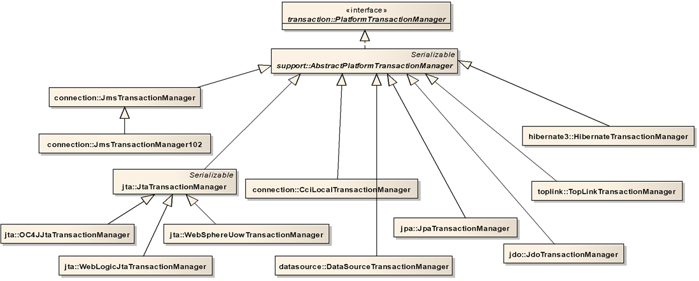
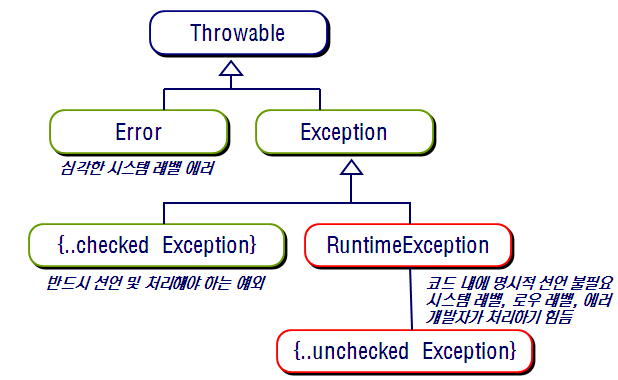

2020.12.08

[Spring Transactions 참고 사이트](https://tedwon.atlassian.net/wiki/spaces/SE/pages/1213150/Spring+Transactions)

### **Spring Transaction**

Spring Transaction은 다양한 트랜잭션 리소스에 대하여 일관성있는 방식을 제공하여 여러가지 이득을 얻을 수 있다.

- 로컬, 글로벌 트랜잭션 지원
- 선언적 방식(Annotation), 프로그래밍적(XML) 방식 지원
- AOP 방식으로 처리
- 일반적인 JTA 트랜잭션 작성 방식보다 간단한 API를 제공한다.

 

### **글로벌 트랜잭션?**

한번에 두 개 이상의 트랜잭션 자원을 같이 처리한다. **(DB 1, DB 2, MQ 등의 여러 시스템)**

자바에서는 JTA API 를 이용하여 글로벌 트랜잭션을 지원한다.

**→ JTA는 JNDI look-up을 통하여 접근하기 때문에, 로직과 JTA API, JNDI 코드가 혼재되게 된다.**

→ 글로벌 트랜잭션을 사용하는 경우 코드의 재사용성이 떨어지게 된다. (재활용하기 어렵다.)

**대부분의 애플리케이션은 글로벌 트랜잭션을 사용하여 로직을 처리하게 된다.**

 

### **로컬 트랜잭션?**

한번에 하나의 단일 트랜잭션 자원만을 처리합니다. 대표적으로는 **JDBC의 Connection으로 트랜잭션을 사용하는 경우**가 있다.

로컬 트랜잭션을 사용하는 경우에는 트랜잭션간의 정합성을 위한 관리자인 AS의 TM이 작동되지 않으므로 두개 이상의 트랜잭션 정합성 보장을 할 수 없다.

→ JTA 커넥션을 사용하는 코드가 여러 라인이 있을 때 JDBC 커넥션을 사용하는 코드가 있다면, 해당 로직은 독립적인 트랜잭션으로 처리가 된다. (글로벌 트랜잭션에 포함되지 않는다.)

[Spring Framework API 2.5](http://static.springframework.org/spring/docs/2.5.x/api/)

 

### **스프링 트랜잭션?**

**스프링 트랜잭션은 위의 방식들의 문제점을 극복할 수 있다.**

PlatformTransactionManager 이라는 인터페이스를 통하여 **추상화된 스프링의 트랜잭션 방식**을 **제공하며 사용하는 DB 연동 기술**에 따라서 각각의 구현 클래스를 제공한다.

 

</img>

 

- **JDBC 기반의 트랜잭션**

    → JDBC, MyBatis 등을 이용하는 경우 DataSourceTransactionManager 를 사용한다.

- **JPA 기반의 트랜잭션**

    → JpaTransactionManager 를 사용한다.

- **Hibernate 기반의 트랜잭션**

    → HiberbateTransactionManager 를 사용한다.

- **JTA 기반의 트랜잭션**

    → JTA (Java Transaction API) 의 경우 JtaTransactionManager 를 사용한다.

    → 빈으로 등록할 때에는 transactionManagerName 프로퍼티를 이용하여 이름을 설정한다.

 

### **Transaction Demarcation?**

애플리케이션의 실행 범위에 대하여서 어느 부분을 트랜잭션 영역을 결정할지 정하는 것

 

### **Declarative Transaction Management?**

ApplicationContext의 XML 설정 파일이나 Annotation 을 통해 트랜잭션을 선언하고 스프링 컨테이너가 내부에서 이루어지는 트랜잭션의 시작, 커밋/롤백 등의 기능을 관리함을 의미한다.

 

### **Spring declarative transaction?**

Spring 의 트랜잭션은 Spring AOP 기반으로 구현하였기에 Proxy 기반으로 작동하게 된다.

→ 스프링 부트에서는 CGLIB 라이브러리를 통해 Spring AOP를 구현한다.

→ 레거시에서는 JDK Dynamic Proxy 를 통하여 구현된다.

 

</img>

### **Spring의 AOP 기반 트랜잭션 작동 원리**

1. Target 메서드를 호출하게 되면 AOP Proxy가 호출
2. Transaction Advisor 가 새로운 트랜잭션을 생성한다.
3. Custom interceptor 들이 transaction advisor 전 후로 호출된다.
4. Target 의 비즈니스 메서드가 호출된다. (real subject)
5. Transaction Advisor 는 커밋 또는 롤백을 결정하고 Proxy 에게 전달한다.
6. AOP Proxy는 결과를 받아 target 메서드를 호출한 대상에게 결과를 전달한다.

 
 

</img>

### **Rollback**

스프링 트랜잭션은 롤백을 Runtime Exception(unchecked exception)와 Checked Exception으로 구분해서 결정하게 된다.

- Runtime Exception 혹은 해당 예외를 상속받은 것은 롤백 처리를 진행
- Checked Exception 은 롤백 처리를 진행하지 않음.