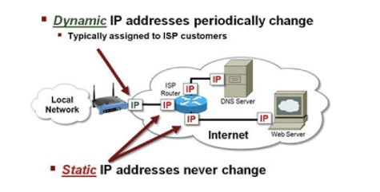

2021.01.05

### 고정 ip, 유동 ip
---

</img>

 

### **유동 IP**
---
기기를 사용할 때 DHCP 서버로부터 남아있는 IP 중에서 하나를 일정 기간만큼 부여받아 사용하는 방식을 말한다. 자체 네트워크 내에서는 기본적으로 유동 ip가 적용된다.

DHCP에게 요청을 보내는 시점은 컴퓨터를 켰을 때 이다. (ARP Protocol)

가용 가능한 IP의 개수가 기기의 개수보다 적을 경우, 해당 기기들이 동작될 때에 가변적으로 제공하는 것은 좀 더 많은 기기에게 인터넷 서비스를 제공할 수 있음을 의미한다

 

**장점?**

- 별도의 장치, 서버를 통해 사용 가능한 ip가 자동으로 부여된다. - 간편한 자동 구성
- 기기의 변경, 추가시 설정된 ip를 삭제하거나 부여할 필요가 없고 고정 ip를 사용함에 있어서 발생할 수 있는 ip 충돌 방지 문제를 해결할 수 있습니다.
- ip가 가변적으로 부여되기 때문에 특정한 ip를 타겟으로 공격하는 보안 공격에 대해 상대적으로 안전하다

 

**단점?**

- 호스팅을 제공하는 웹 사이트, 서버에서 가변적인 ip를 사용할 경우 매 시점마다 원활한 작동을 보장할 수 없으며, 해당 문제를 해결하기위해 **동적 dns 구성, 서비스 이용** 등 별도 비용이 필요하다.

    → 접근 요청을 보낸 ip와 현재 기기가 부여받은 ip가 다를 경우 요청 실패

- 가용 ip가 부족하거나 ISP의 일시적인 장애로 인해 IP 주소를 할당받지 못하여 인터넷의 연결이 중단될 수 있다.

**동적 DNS?**

해당 기기의 IP 주소가 변경되면 기기에 대한 DNS 정보가 자동으로 변경된다. 

 

### **고정 IP**
---
기기에 고정적으로 부여된 IP를 말하며, 해당 IP가 반납되기 전까지는 다른 장비에 부여할 수 없는 방식을 말한다. 일반적으로 서버 또는 중요 장비에서 사용된다.

**장점?**

- 어떠한 서비스, 서버를 운영하는 경우 외부에서 접근하는 사용자가 기본 제공되는 DNS 서버를 통해 쉽고 빠르게 요청을 보낼 수 있다.
- 서버에 대해 VPN이나 SSH 등을 사용하는 원격 프로그램을 통해 작업하기가 간편하다.
- ip를 고정적으로 부여받기에 상대적으로 안정적인 인터넷 서비스를 이용할 수 있다.

**단점?**

- 고정 ip로 서버, 서비스가 제공하고 있을 경우 공격자의 입장에서 쉽게 위치를 식별하고 공격할 수 있다. 방화벽, ACG 등과 같은 설정을 필요로 한다.
- 고정 IP 비용이 상대적으로 비싸다.