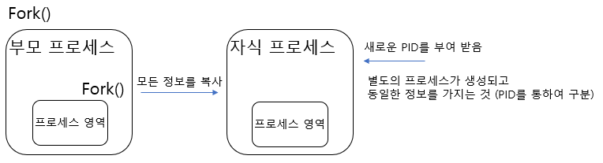
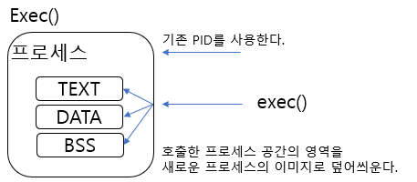

2020.12.04

### 프로세스 구조와 fork(), exec()

 

</img>

 

</img>

**fork()** 

- **새로운 프로세스 공간을 만들고 해당 시스템 콜을 호출한 프로세스의 공간(정보)를 모두 복사한다.**

    → 별도의 프로세스 공간을 만들고, 부모 프로세스 공간의 데이터를 그대로 복사한다.

    → 동일한 정보를 가지는 자식 프로세스를 만들게 된다

 
 

</img>

 

**exec()**

- 해당 시스템 콜을 호출한 프로세스 공간의 TEXT, DATA, BSS 영역을 새로운 프로세스의    이미지(코드)로 덮어씌운다. **( 즉 exec를 통해 호출되어 온 프로세스 정보만이 남는다. )**

    → 별도의 프로세스 공간을 만들지 않고 기존 사용 공간을 이용한다.